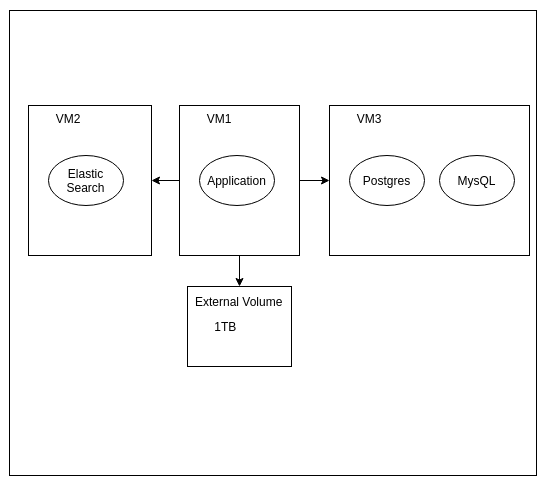

# Introduction

CurrikiStudio enables you to create interactive learning content and publish them anywhere like Google Classroom, LMSs etc

# Components

## Applications

Following applications are the part of CurrikiStudio

1. [React Frontend application](https://github.com/ActiveLearningStudio/ActiveLearningStudio-react-client)
2. [Backend API](https://github.com/ActiveLearningStudio/ActiveLearningStudio-API)
3. [Tsugi for LTI](https://github.com/tsugiproject/tsugi)
4. [Trax LRS](https://github.com/trax-project/trax-lrs)

## Databases

1. External Postgres (For API, For LRS)
2. External MySQL (For Tsugi)

## Minimum Requirements

1. 8GB RAM
2. 4 VCPUs
3. Tried on Ubuntu, Amaozon Linux, Oracle Linux. This list will grow after testing

## Pre-Requisites

1. Docker version 19 or above

# Infrastructure

Our Minimal Infrastructure is composed of 3 Linux VMs. All are running docker containers inside those

**1. VM1: CurrikiStudio Application**
**2. VM2: Databases: Postgres + MySQL**

## Structure

## Deployment of VM2 (Database VM)

Install [docker compose](https://docs.docker.com/compose/install/)

Run following commands

    git clone https://github.com/ActiveLearningStudio/ActiveLearningStudio-docker-db.git curriki-db
	cd curriki-db
	cp .env.example .env
	sudo mkdir -p /mnt/DBData/currikiprod1-mysqldata
	sudo mkdir -p /mnt/DBData/currikiprod1-postgresdata
	sudo mkdir -p /mnt/DBData/pgadmin1-data
	sudo docker-compose up -d

## Deployment of VM1 

Applications will be deployed on VM1

## Installation Steps

1. git clone https://github.com/ActiveLearningStudio/ActiveLearningStudio-docker-containers
2. Create environemnt files for client / api / tsugi / trax
3. Generate ssl (We are using letsencrypt) (sudo ./init-letsencrypt.sh)
4. Run command

> docker swarm init
> docker stack deploy -c docker-compose.yaml currikistack

### For Ubuntu 
[https://www.digitalocean.com/community/tutorials/how-to-install-and-configure-elasticsearch-on-ubuntu-18-04](https://www.digitalocean.com/community/tutorials/how-to-install-and-configure-elasticsearch-on-ubuntu-18-04)

### For CentOS 7

[https://www.digitalocean.com/community/tutorials/how-to-install-and-configure-elasticsearch-on-centos-7](https://www.digitalocean.com/community/tutorials/how-to-install-and-configure-elasticsearch-on-centos-7)

### For Lets encrypt Add DNS records

1. Copy public ip of the VM and put inside the DNS records like this.

Say public ip of your VM is 132.226.36.47

You must create these A records like

    example.currikistudio.org 132.226.36.47
	example-admin.currikistudio.org 132.226.36.47
	example-tsugi.currikistudio.org 132.226.36.47
	example-trax.currikistudio.org 132.226.36.47

This step is necessary to generate letsencrypt certificate which will be discussed later in this section
